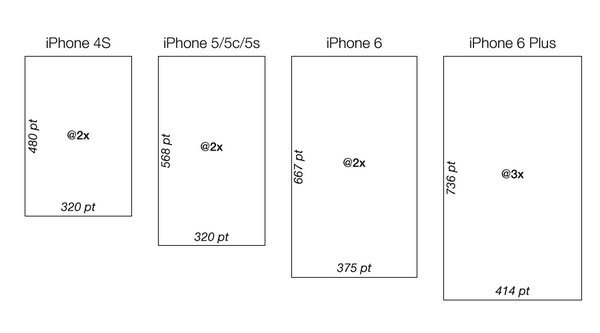

##名词解释:
px：(pixels)（像素）：屏幕上的点，与密度相关。密度大了，单位面积上的px会比较多。表示屏幕实际的象素。例如，320*480的屏幕在横向有320个象素，在纵向有480个象素。

dip或dp（与密度无关的像素）。这个和设备硬件有关，为了支持WVGA、HVGA和QVGA 推荐使用这个。一种基于屏幕密度的抽象单位。设置一些view的宽高可以用这个，一般情况下，在不同分辨率，都不会有缩放的感觉。如果用px的话，320px占满HVGA的宽度，到WVGA上就只能占一半不到的屏幕了。

sp（与刻度无关的像素）放大像素– 主要处理字体的大小。

in：表示英寸，是屏幕的物理尺寸。每英寸等于2.54厘米。例如，形容手机屏幕大小，经常说，3.2（英）寸、3.5（英）寸、4（英）寸就是指这个单位。这些尺寸是屏幕的对角线长度。如果手机的屏幕是3.2英寸，表示手机的屏幕（可视区域）对角线长度是3.2*2.54 = 8.128厘米。

mm：表示毫米，是屏幕的物理尺寸。

pt：表示一个点，是屏幕的一个物理长度，大小为1英寸的1/72。

Density: 指每平方英寸中的像素数。
**Density=Resolution/Screen size**<br>


##android分辨率和像素
HVGA屏density=160<br>
QVGA屏density=120<br>
WVGA屏density=240<br>
WQVGA屏density=120<br>

**换算公式：**
pixels = dips * (density / 160)
***density一般为3个常用固定值240/160/120***

***android dp/px换算代码***
```java
import android.util.DisplayMetrics;

/**
 * 计算公式 pixels = dips * (density / 160)
 * 
 * @version 1.0.1 2010-12-11
 * 
 * @author
 */
public class DensityUtil {
	
	private static final String TAG = DensityUtil.class.getSimpleName();
	
	// 当前屏幕的densityDpi
	private static float dmDensityDpi = 0.0f;
	private static DisplayMetrics dm;
	private static float scale = 0.0f;

	/**
	 * 
	 * 根据构造函数获得当前手机的屏幕系数
	 * 
	 * */
	public DensityUtil(Context context) {
		// 获取当前屏幕
		dm = new DisplayMetrics();
		dm = context.getApplicationContext().getResources().getDisplayMetrics();
		// 设置DensityDpi
		setDmDensityDpi(dm.densityDpi);
		// 密度因子
		scale = getDmDensityDpi() / 160;
		Logger.i(TAG, toString());
	}

	/**
	 * 当前屏幕的density因子
	 * 
	 * @param DmDensity
	 * @retrun DmDensity Getter
	 * */
	public static float getDmDensityDpi() {
		return dmDensityDpi;
	}

	/**
	 * 当前屏幕的density因子
	 * 
	 * @param DmDensity
	 * @retrun DmDensity Setter
	 * */
	public static void setDmDensityDpi(float dmDensityDpi) {
		DensityUtil.dmDensityDpi = dmDensityDpi;
	}

	/**
	 * 密度转换像素
	 * */
	public static int dip2px(float dipValue) {

		return (int) (dipValue * scale + 0.5f);

	}

	/**
	 * 像素转换密度
	 * */
	public int px2dip(float pxValue) {
		return (int) (pxValue / scale + 0.5f);
	}

	@Override
	public String toString() {
		return " dmDensityDpi:" + dmDensityDpi;
	}
}
```

下面以480dip*800dip的WVGA(density=240)为例，详细列出不同density下屏幕分辨率信息：

当density=120时 屏幕实际分辨率为240px*400px （两个点对应一个分辨率）
状态栏和标题栏高各19px或者25dip
横屏是屏幕宽度400px 或者800dip,工作区域高度211px或者480dip
竖屏时屏幕宽度240px或者480dip,工作区域高度381px或者775dip

density=160时 屏幕实际分辨率为320px*533px （3个点对应两个分辨率）
状态栏和标题栏高个25px或者25dip
横屏是屏幕宽度533px 或者800dip,工作区域高度295px或者480dip
竖屏时屏幕宽度320px或者480dip,工作区域高度508px或者775dip

density=240时 屏幕实际分辨率为480px*800px （一个点对于一个分辨率）
状态栏和标题栏高个38px或者25dip
横屏是屏幕宽度800px 或者800dip,工作区域高度442px或者480dip
竖屏时屏幕宽度480px或者480dip,工作区域高度762px或者775dip

apk的资源包中，当屏幕density=240时使用hdpi标签的资源
当屏幕density=160时，使用mdpi标签的资源
当屏幕density=120时，使用ldpi标签的资源。
不加任何标签的资源是各种分辨率情况下共用的。
建议：布局时尽量使用单位dip，少使用px。

device independent pixels(设备独立像素). 不同设备有不同的显示效果,这个和设备硬件有关，一般我们为了支持WVGA、HVGA和QVGA 推荐使用这个，不依赖像素。

##iOS分辨率和像素

**经新xcode6模拟器验证（分辨率为pt，像素为真实pixel）：**

iPhone4分辨率320x480，像素640x960，@2x<br>
iPhone5分辨率320x568，像素640x1136，@2x<br>
iPhone6分辨率375x667，像素750x1334，@2x<br>
iPhone6 Plus分辨率414x736，像素1242x2208，@3x，

***iPhone6 Plus***
```objective-c
    CGRect screen = [UIScreen mainScreen].bounds;
    screen = (width = 414, height = 736)
```
（注意，在这个分辨率下渲染后，图像等比降低pixel分辨率至1080p(1080x1920)）<br>
rel:[ultimate-guide-to-iphone-resolutions](http://www.paintcodeapp.com/news/ultimate-guide-to-iphone-resolutions)

